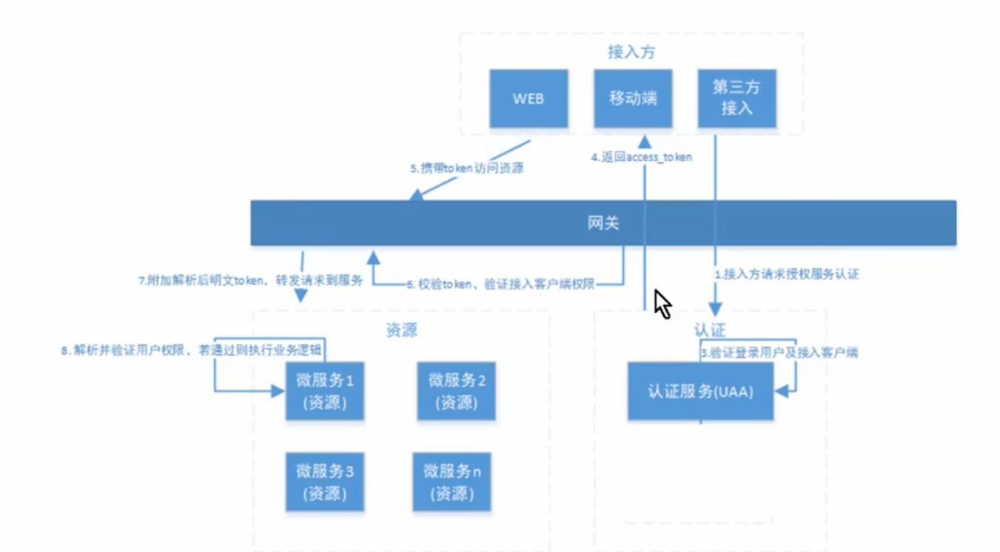

#Spring Security 

###认证
用户认证就是判断用户的身份是否合法的过程。
例如：用户密码认证、二维码、手机短信、指纹认证等。

###授权
根据用户权限，控制用户访问资源。

###授权数据模型
用户主体 对 资源 进行 何种操作。

资源： 数据资源和功能资源。 也就是常说的 功能权限和数据权限。

##工作原理
参考：
[https://www.bilibili.com/video/BV1VE411h7aL?p=14](https://www.bilibili.com/video/BV1VE411h7aL?p=14)

1.基于filterchain拦截链。
2.

###分布式服务统一认证授权

