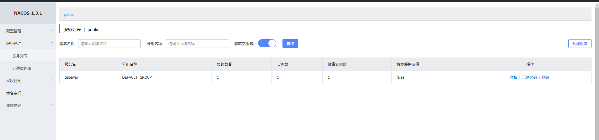
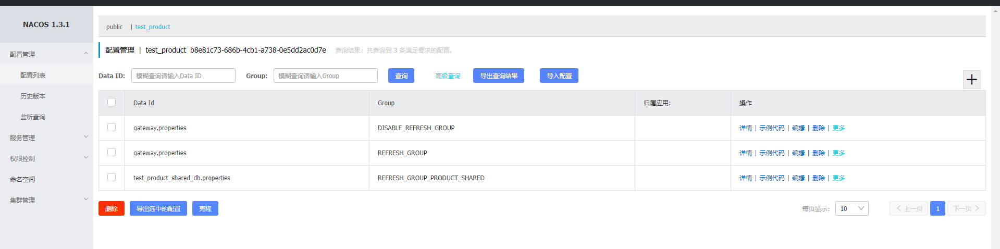
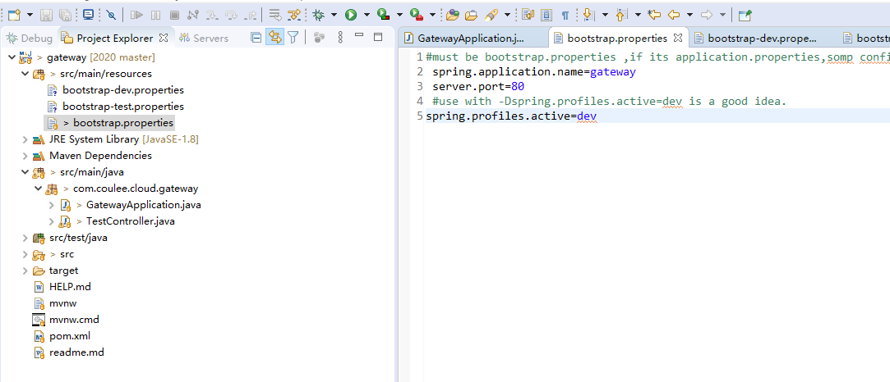
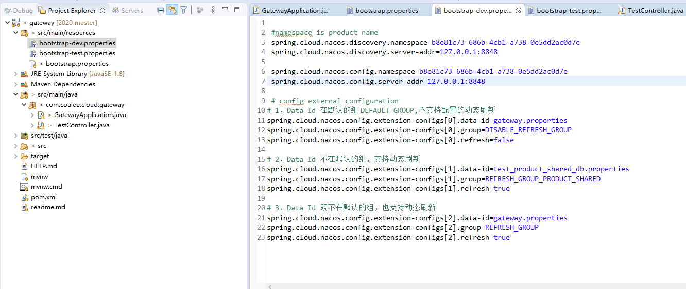
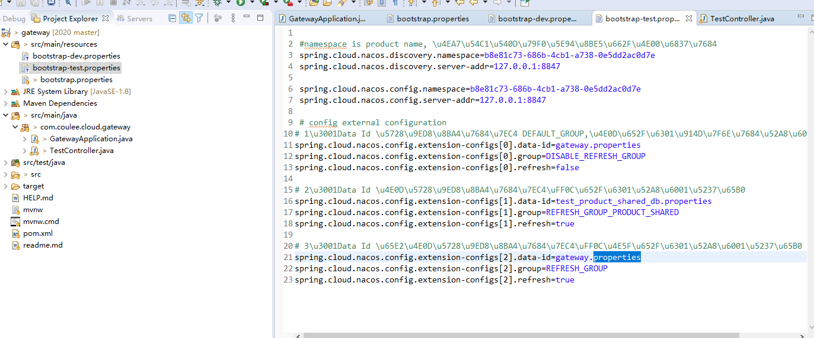

###安装下载
参考 [https://github.com/alibaba/nacos](https://github.com/alibaba/nacos "nacos github")

先使用本地包方式用于开发模式运行。
控制台默认密码：nacos/nacos

说一下为啥要选择nacos:
> 以前项目采用eureka做服务注册与发现，zookeeper集群做配置中心，zuul做微服务网关	。
> 
> 以前的问题在于配置中心的页面配置是全自己写的，不可避免有些bug.同时，由于更新zookeeper节点的策略不太好，导致每次更新配置很慢。
> 
> 以前eureka默认的服务注册中心管理页面也比较简陋，也没法做一些限流处理。
> 
> 查看nacos手册，发现一个nacos就能解决服务注册/发现，限流，配置中心等。也减少了运维人员的工作量和学习使用成本，因此考虑切换到nacos来做注册中心和配置中心。
> 
> 唯一缺陷就是，目前nacos集群部署只支持mysql数据库。

###运行

参考官方手册，先开始用起来。
[https://nacos.io/zh-cn/docs/console-guide.html](https://nacos.io/zh-cn/docs/console-guide.html "nacos使用手册")	

###注册
需要注意的是：[springhttps://start.spring.io/		](https://start.spring.io/ "spring官方")	，官方什么spring boot的版本要在2.2.0--2.3.0之间。

参考[https://github.com/alibaba/spring-cloud-alibaba/blob/master/spring-cloud-alibaba-examples/nacos-example/nacos-discovery-example/readme.md](https://github.com/alibaba/spring-cloud-alibaba/blob/master/spring-cloud-alibaba-examples/nacos-example/nacos-discovery-example/readme.md "服务注册")	文档，将gateway服务注册到nacos。查看控制台如下:

	
		

###使用

1. 命名空间

	`参考官方手册，我的理解是这个命名空间是用来区分不同配置的。类似于application-dev,application-prod,application-test等，用于实现同一配置项的不同配置值，方便开发和测试使用`		
	注意：命名空间配置在使用是必须是ID： spring.cloud.nacos.discovery.namespace=id.

###配置中心使用
参考：

[https://github.com/alibaba/spring-cloud-alibaba/wiki/Nacos-config](https://github.com/alibaba/spring-cloud-alibaba/wiki/Nacos-config "config 使用手册")

[https://github.com/alibaba/spring-cloud-alibaba/issues/141](https://github.com/alibaba/spring-cloud-alibaba/issues/141 "官方对于共享配置实现的讨论")

[https://github.com/alibaba/spring-cloud-alibaba/blob/master/spring-cloud-alibaba-docs/src/main/asciidoc/nacos-config.adoc](https://github.com/alibaba/spring-cloud-alibaba/blob/master/spring-cloud-alibaba-docs/src/main/asciidoc/nacos-config.adoc "nacos配置中心")

[http://blog.didispace.com/spring-cloud-alibaba-nacos-config-2/](http://blog.didispace.com/spring-cloud-alibaba-nacos-config-2/ "nacos 配置中心")

[https://blog.csdn.net/qq_33619378/article/details/98634900](https://blog.csdn.net/qq_33619378/article/details/98634900 "配置中心隔离")

1. 配置中心直接使用规则

2. 共享配置

3. 配置项生效顺序

 	`后面的配置项会覆盖前面的` 

####结合公司实际情况，实际搭建的nacos配置方式和规则

0.目前公司级的配置，应该还用不上角色管理等。一个人（几个人）共用一个账号管理配置即可。

1.公司的开发会有一套开发环境/测试/生产各一套环境，开发和测试nacos不共用。公司搭建两套nacos服务。

2.公司多个产品在开发阶段时，都往同一个开发的nacos环境注册和添加配置。这样在生产时，多个产品也是可以往同一套nacos去注册，简化了各个环境中的nacos数量和配置。

3.区分各个产品的配置时，使用namcespace来区分。这样各个产品都往自己的namespace注册，互不干扰。（产品间应当是完全隔离的，多个产品原则上不应该使用相同的配置。即使他们都在同一个注册中心/配置中心进行注册。）
而一个产品可能会包含多个应用，多个应用间的配置是可以有共用部分的。

4.创建GROUP:

- REFRESH_GROUP_PRODUCT_SHARED
	
	> 支持动态刷新的配置文件，必须添加在该组中。并且这些配置还是可以在产品间共享的

- DISABLE_REFRESH_GROUP_PRODUCT_SHARED 
	
	> 不支持动态刷新的配置文件，必须添加在该组中，这些配置还可以是在产品间共享的。如果配置不共享，就不建议添加到该组。

- REFRESH_GROUP 
	
	> 支持动态刷新的配置文件，必须添加在该组中。（一般是某个应用才独有的配置）

- DISABLE_REFRESH_GROUP

	> 不支持动态刷新的配置文件，必须添加在该组中。（一般是某个应用独有的配置）

5.namespace下，多个应用共享配置的配置方式和配置规则
	
	>spring.application.name=opensource-service-provider
	spring.cloud.nacos.config.server-addr=127.0.0.1:8848
	
	# config external configuration
	# 1、Data Id 在默认的组 DEFAULT_GROUP,不支持配置的动态刷新
	spring.cloud.nacos.config.extension-configs[0].data-id=ext-config-common01.properties
	
	# 2、Data Id 不在默认的组，不支持动态刷新
	spring.cloud.nacos.config.extension-configs[1].data-id=ext-config-common02.properties
	spring.cloud.nacos.config.extension-configs[1].group=GLOBALE_GROUP
	
	# 3、Data Id 既不在默认的组，也支持动态刷新
	spring.cloud.nacos.config.extension-configs[2].data-id=ext-config-common03.properties
	spring.cloud.nacos.config.extension-configs[2].group=REFRESH_GROUP
	spring.cloud.nacos.config.extension-configs[2].refresh=true

优先级

	多个 Data Id 同时配置时，他的优先级关系是 spring.cloud.nacos.config.extension-configs[n].data-id 其中 n 的值越大，优先级越高。
	
	spring.cloud.nacos.config.extension-configs[n].data-id 的值必须带文件扩展名，文件扩展名既可支持 properties，又可以支持 yaml/yml。 此时 spring.cloud.nacos.config.file-extension 的配置对自定义扩展配置的 Data Id 文件扩展名没有影响。

样例参考：

	
	
	

这样，开发时只需改动dev/prod/test即可切换到不同配置。