#sentinel 熔断实践
##限流
个人理解，限流又分为下面几种场景：
1.通过本地接口http:url/直接访问consumer的本地local接口。
2.通过网关调用 consumer的本地local接口。
3.通过网关调用 consumer的remoteecho接口，但remoteecho接口只会被限流，一般不会抛异常。
4.通过网关调用 consumer的remoterandom接口，该接口有可能抛出一些业务异常。
###一、通过http:url:port调用consumer本地local接口
1.开始并不配置限流规则，测试发现：只要一直刷新，响应就能正常返回。

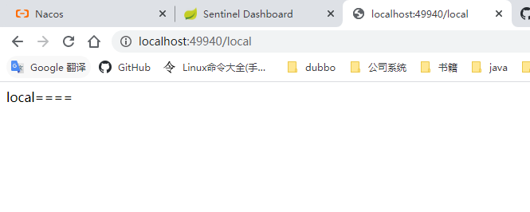

2.开始往sentinel中添加限流规则
>首先发现，流控规则被同步到了nacos.

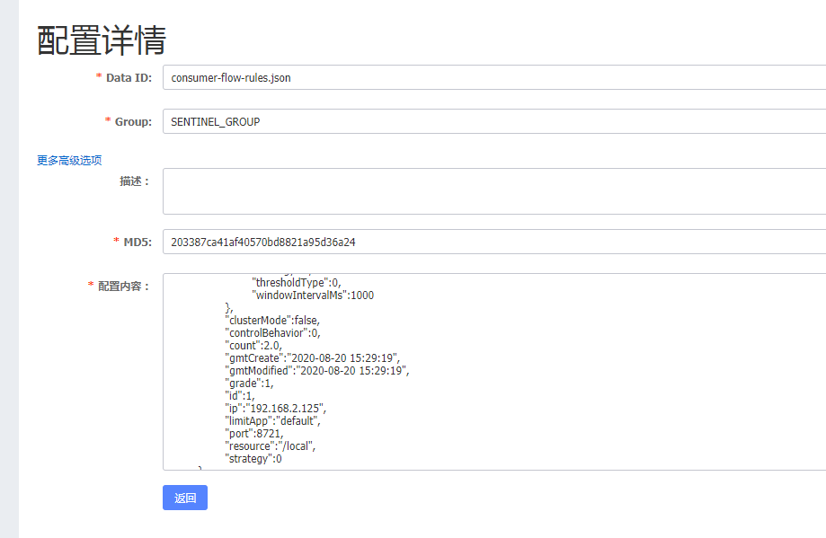

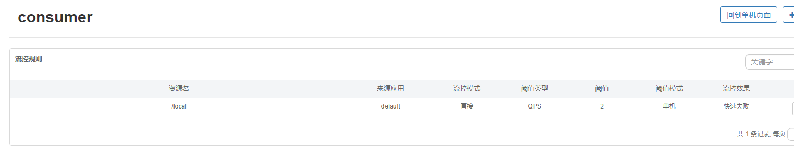

>然后刷新页面，刷新频率变高时，界面出现限流响应。

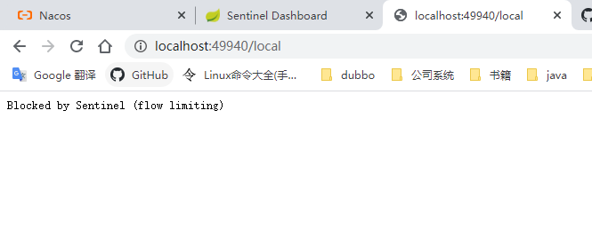

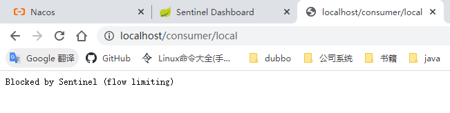

可以看出，不论是直接调用还是通过网关调用，流控规则都是生效了的。

###二、尝试直接对local添加降级规则

直接添加限流并未生效，原因是因为consumer的代码并未设置相应的降级措施。

		/**
		 * consumer的本地调用
		 * 
		 * @return
		 */
		@RequestMapping("/local")
		public String local() {
			String rst = "local====";
			return rst;
		}

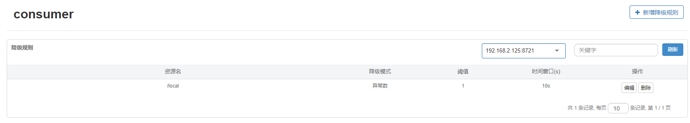

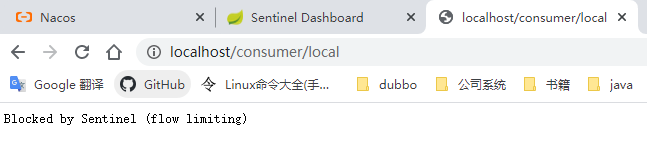

###三、测试remoteecho流控规则
0.未添加任何流控规则，remoteecho接口可以访问，高频的刷新一直正常响应。
1.添加流控规则,规则同步到nacos.

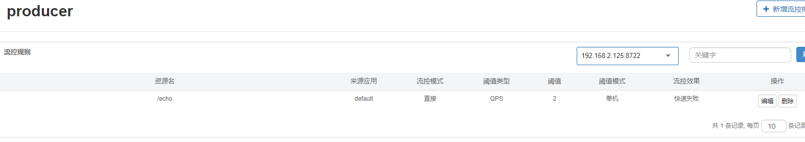

2.添加流控规则后，再次刷新，间歇性的出现提示远端业务服务错误提示。这是因为producer被限流，抛出了异常。
但是异常通过http接口返回后，变成以下信息，这不是fallback处理的blockexception，所以走最后一个分支，参考下面的代码。
	
	feign.FeignException$TooManyRequests: [429] during [GET] to [http://producer/echo] [ProducerService#echo()]: [Blocked by Sentinel (flow limiting)]

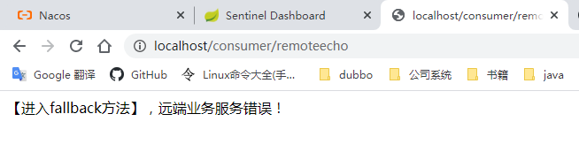

		@RequestMapping("/remoteecho")
		@SentinelResource(value = "remoteecho2", fallback = "fallback", blockHandler = "blockHandler")
		public String remoteInvoke() {
			String rst = "remote====" + producer.echo();
			return rst;
		}
		/***
		 * 这里的远端服务异常，有可能是远端抛出异常，也可能是远端的sentinel。
		 * 
		 * @param throwable
		 * @return
		 */
		public String fallback(Throwable throwable) {
			if (BlockException.isBlockException(throwable)) {
				log.warn("这个是一个block异常", throwable);
				if (throwable instanceof DegradeException) {
					log.warn("这个是一个degraede异常", throwable);
					return "【进入fallback方法】，远端服务degraede异常错误！";
				}
				return "【进入fallback方法】，远端服务block异常错误！";
			} else {
				log.warn("远端业务异常", throwable);
				return "【进入fallback方法】，远端业务服务错误！";
			}
		}

3.添加降级规则（降级规则添加到哪里呢？是consumer的remoteecho还是producer的echo？）

分析后：我认为应该是在consumer对remoteecho下的对应资源添加降级规则。

验证，先在producer端添加降级规则：

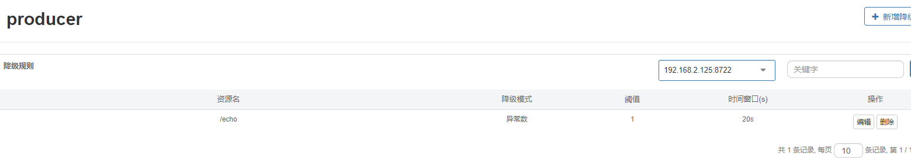

刷新页面，效果仍然和之前的一样。

在consumer对consumer请求的远端服务添加降级规则：
>需要注意的是，该规则是针对SentinelResource 上标记的资源实行降级。

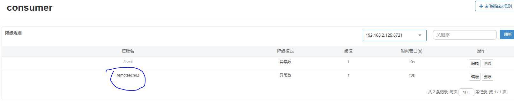

再次刷新界面，先是因为满足限流，返回了block消息，再是因为返回的block异常数满足了降级规则，后续的多次请求都直接被熔断。

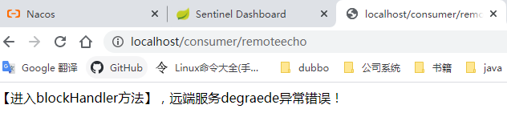
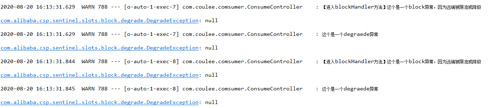

代码：
	
	/**
	 * 若 blockHandler 和 fallback 都进行了配置，则被限流降级而抛出 BlockException 时只会进入 blockHandler
	 * 处理逻辑。
	 * 
	 * @param e
	 * @return
	 */
	// sentinel降级
	public String blockHandler(BlockException e) {
		log.warn("【进入blockHandler方法】这个是一个block异常，因为远端被限流或降级", e);
		if (e instanceof DegradeException) {
			log.warn("这个是一个degraede异常", e);
			return "【进入blockHandler方法】，远端服务degraede异常错误！";
		}
		return "【进入blockHandler方法】,远端被限流，请稍后再试";
	}

>通过该分析说明，降级规则的添加应当是在调用方。

###四、测试remoterandom接口

直接刷新界面，发现由于远端代码的随机错误，所以该接口和远端一样的提示错误信息。
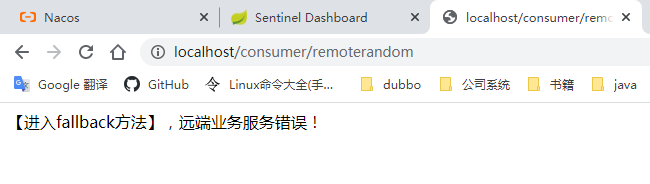

直接添加降级规则（注意，该降级规则是直接添加到consumer上的）：
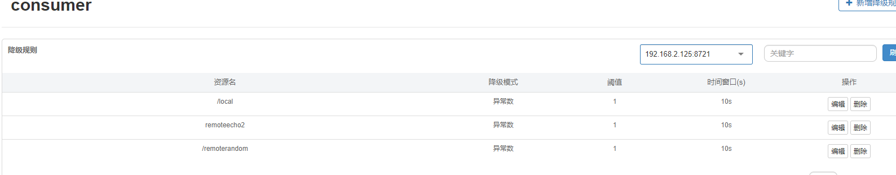

刷新测试发现，界面反应和不加降级规则是一样的。分析原因：

> 因为降级规则是直接添加在consumer的randomecho接口上，但是其实每次randomecho接口都是“正常”返回到前端的，因此sentinel不会认为该接口是有异常的。所以降级规则和想象的不一样。

再次测试，添加降级规则到remote的producer的random接口：

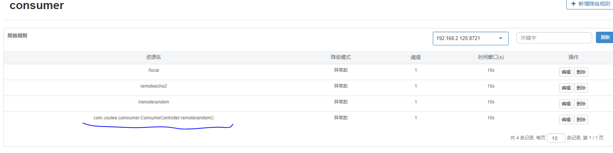

刷新界面测试，经历一次fallback后，接口立马降级变成降级异常的错误。
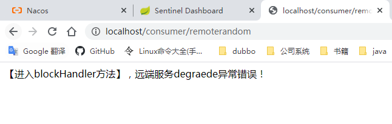

结论：
降级规则添加的位置应该在是调用方，对调用的资源添加降级规则。

###五、测试producer添加降级规则

1.往producer的/random添加降级规则

2.删除consumer接口针对remoterandom的降级规则

3.访问 http://localhost/consumer/remoterandom，接口，只要返回过一次错误后，后续就会一直返回错误（因为接口被降级）
	[Blocked by Sentinel (flow limiting)]

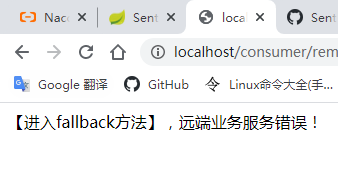

4.删除producer的/random添加降级规则后，再次访问 http://localhost/consumer/remoterandom接口，接口正常，随机返回成功失败。

5.把producer的/random添加降级规则再次添加回去，使用http://localhost/producer/random直接访问
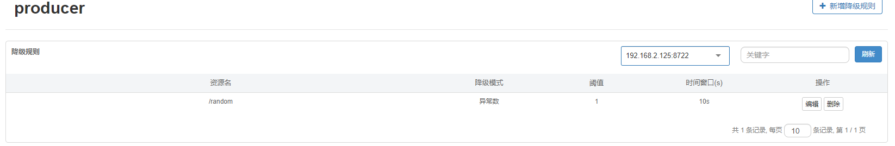
6.访问结果，当出现一次访问失败时，后续的访问都被降级。但降级默认异常信息是一个 [Blocked by Sentinel (flow limiting)]消息。

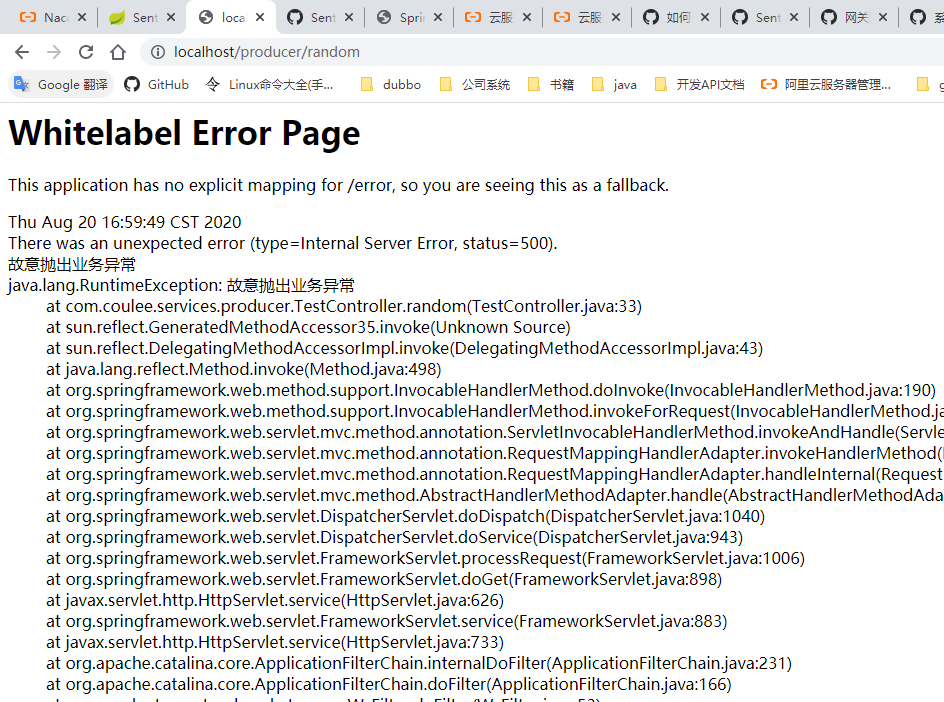
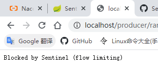

###六、feignfallback使用

1.feign 默认是轮询的

2.初步理解，sentinelresource 的作用是定义资源名，定义fallback等。那它就替代了一部分feign的功能。因此，我们在系统内不添加sentinelresource注解，直接使用feignclient来测试限流与降级。（开启feignenable），再次进行测试。

3、producer添加代码

4.刷新界面，发现簇点链路
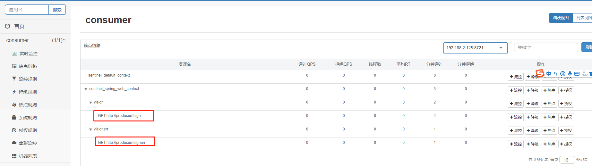

5.对feignclient的限流，就应当在该链路上下发流控规则。

###feign使用

#####1.允许sentinel feign ,开启如下配置：

	feign.sentinel.enabled=true

#####2.producer端添加服务提供接口
	
	@RequestMapping("/feign")
	public String feign() {
		return getMsg() +"/feign";
	}
	
	@RequestMapping("/feignerr")
	public String feignerr() {
		if(System.currentTimeMillis()%4 == 0) {//随机来看4次有一次返回错误
			throw new RuntimeException(getMsg()+",/feignerr 故意抛出异常");
		}
		return getMsg() +"/feignerr";
	}
	
#####3.consumer端添加feign接口
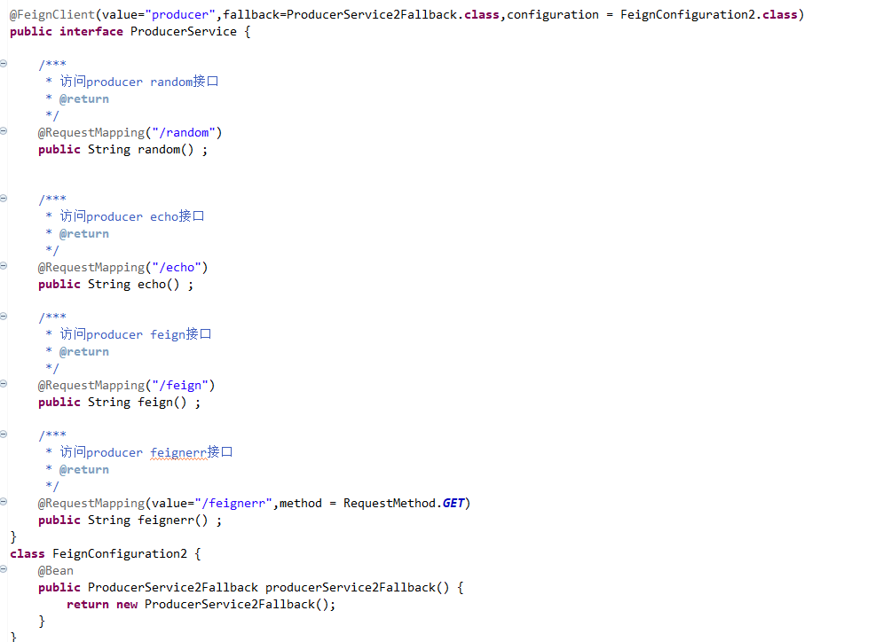

#####4.consumer端的fallback设置

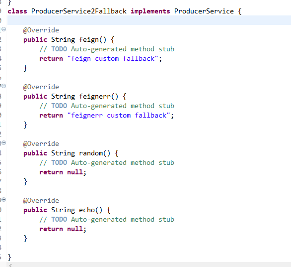

#####5.由于feign注解没有区分fallback和blockhand的异常，因此，当producer限流时，如果返回异常，consumer端处理时应该自己去区分block限流，或者是服务异常

#####6.访问feign接口：
查看访问结果，通过feign调用到了远端接口。并且触点链路中有新的远程接口产生。

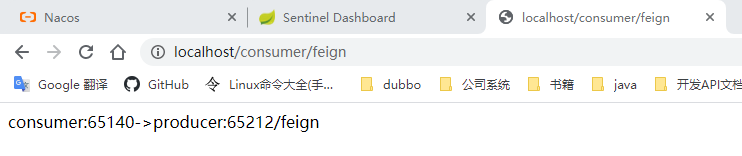

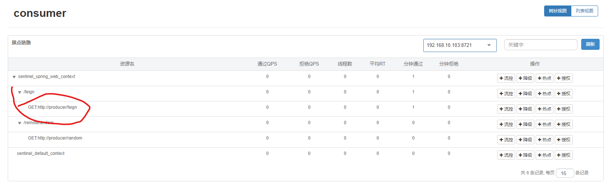

#####7.访问feignerr接口：
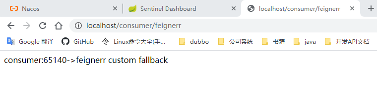

可以发现，通过feign调用可以不再自己定义sentinelresource接口。这样做会简化编码，同时也更合理，代码在哪里远程调用就在哪里进行fallback.

##最佳实践

#####1.思考，限流一般情况下，应当都是在服务提供者处提供限流。

即：服务提供方应当明确自己服务的负载是多少，无论是集群也好，单机也好。服务提供者明确自己的最大QPS限流（或者其他规则）。

#####2.作为服务提供者，如果有限流发生时，应当提供明确的消息，表明服务提供方服务能力已达上限。我觉得应当是下面类似的消息：

	{code:-1,msg:"当前访问人数过多，请稍后再试。"，data:""}

#####3.作为服务消费者，熔断策略应当在消费者处配置：
服务消费者也应当提供限流策略，但是这个限流策略应当是限制消费者的整个并发访问量的，和服务提供方的接口限流规则无关。（正常情况下消费者方的流量不可能全部打到服务提供者的接口上）

由于在消费者处访问服务提供者接口时，服务方可能会返回异常（消费者失联，网络原因，消费者服务整个挂掉），错误（限流，业务错误消息）等两类情况。因为feign接口的异常转换，所以在fallback处和正常代码处都应该合理的处理。

##测试:

1.给服务提供者feign接口设置限流规则，QPS=2.

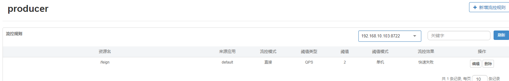

2.服务提供者接口改造：

2.1添加限流异常的拦截处理

	
	/**
	 * 方式一、注入自己实现的限流异常处理，自己的处理就是不处理抛出异常，然后交给外层的controller异常处理器统一进行处理
	 * 方拾二、直接这里拦截返回页面429status,+msg.
	 * 
	 * 这里先采用方式2.方式1也测试过，需要搭配controlleradvice做异常拦截，测试也OK。
	 */
	@Override
	public void addInterceptors(InterceptorRegistry registry) {
		SentinelWebMvcConfig config = app.getBean(SentinelWebMvcConfig.class);
		config.setBlockExceptionHandler((request, response, e) -> {
			// Return 429 (Too Many Requests) by default.
	        StringBuffer url = request.getRequestURL();
	        if ("GET".equals(request.getMethod()) && StringUtil.isNotBlank(request.getQueryString())) {
	            url.append("?").append(request.getQueryString());
	        }
	        log.warn("接口被限流：{}",url);
	        response.setStatus( HttpStatus.TOO_MANY_REQUESTS.value());
	        PrintWriter out = response.getWriter();
	        out.print(HttpStatus.TOO_MANY_REQUESTS.getReasonPhrase());//限流提示
	        out.flush();
	        out.close();
	        });
	}
3.直接测试producer接口的限流异常返回：

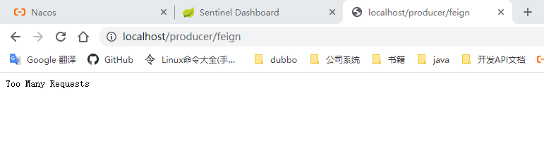

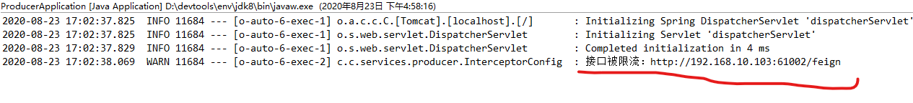

4.消费者端的改造：

