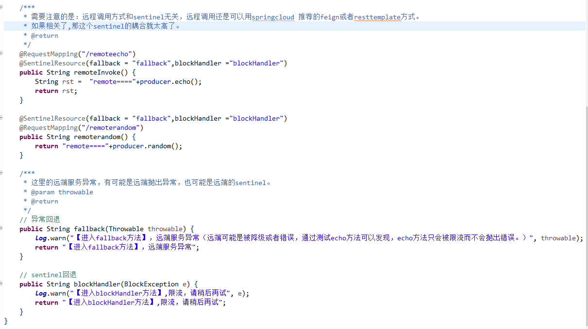
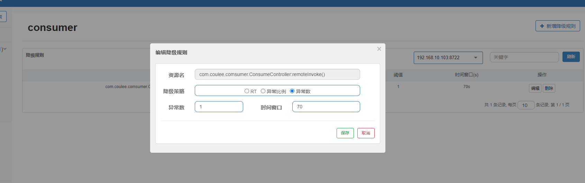
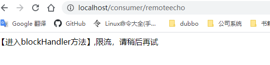
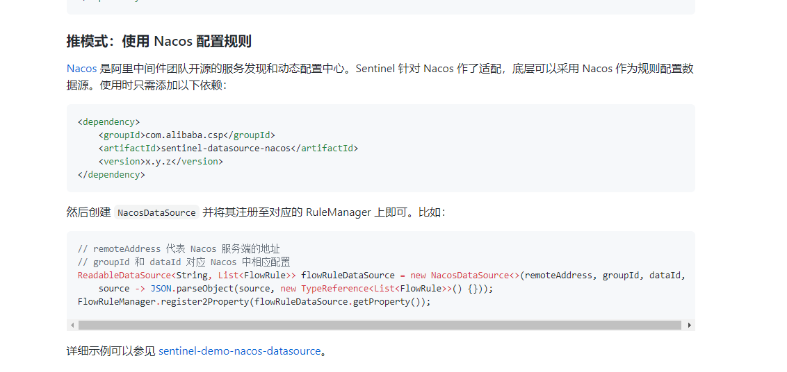
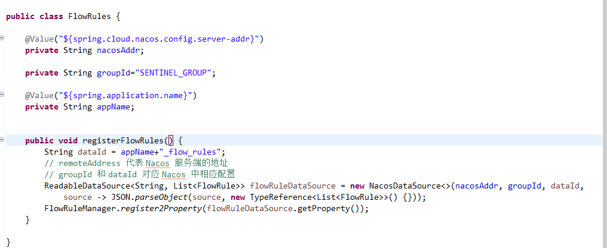
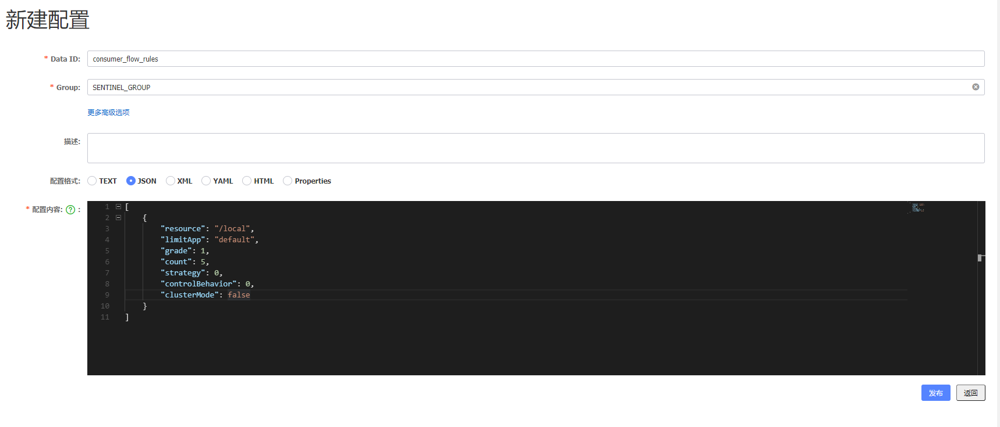

###sentinel

[https://github.com/alibaba/Sentinel/wiki/%E4%BB%8B%E7%BB%8D](https://github.com/alibaba/Sentinel/wiki/%E4%BB%8B%E7%BB%8D "文档")

[https://github.com/alibaba/Sentinel/wiki/%E5%A6%82%E4%BD%95%E4%BD%BF%E7%94%A8](https://github.com/alibaba/Sentinel/wiki/%E5%A6%82%E4%BD%95%E4%BD%BF%E7%94%A8 "使用")

[https://github.com/alibaba/spring-cloud-alibaba/wiki/Sentinel](https://github.com/alibaba/spring-cloud-alibaba/wiki/Sentinel "springcloud alibab")

[https://github.com/alibaba/Sentinel/wiki/%E7%BD%91%E5%85%B3%E9%99%90%E6%B5%81#spring-cloud-gateway](https://github.com/alibaba/Sentinel/wiki/%E7%BD%91%E5%85%B3%E9%99%90%E6%B5%81#spring-cloud-gateway "网关限流")

####使用
#####sentinel控制台
1.下载控制台jar包

2.执行
	
	java -Dserver.port=8080 -Dcsp.sentinel.dashboard.server=localhost:8080 -Dproject.name=sentinel-dashboard -jar sentinel-dashboard.jar

3.登录查看控制台：
	http://47.107.142.148:8080/#/dashboard

#####sentinel 整合spring cloud gateway.

1. gateway 网关接入：

	启动参数添加：
		
		#表明是一个网关	
		-Dcsp.sentinel.app.type=1		
		-Dcsp.sentinel.dashboard.server=localhost:8080

2. 普通的client 接入：
		
		#表示注册到localhost:8080 的sentinel控制台上。
		-Dcsp.sentinel.dashboard.server=localhost:8080

3. 通常，在目前的使用场景下，如果需要限流的话，我只需要把网关接入到sentinel中就行

#####配置
对于流量进行限流配置:

	

不断的刷新，可以看到1秒只能有1个正常的响应，其他请求都被限流。

服务注册到云端时,由于IP限制的原因，无法获取到限流信息。因此配置改为本地配置

系统自适应限流规则：
[https://github.com/alibaba/Sentinel/wiki/%E7%B3%BB%E7%BB%9F%E8%87%AA%E9%80%82%E5%BA%94%E9%99%90%E6%B5%81](https://github.com/alibaba/Sentinel/wiki/%E7%B3%BB%E7%BB%9F%E8%87%AA%E9%80%82%E5%BA%94%E9%99%90%E6%B5%81 "自适应限流")
	
代码：
	
	@Slf4j
	@Configuration
	public class SentinelConfig {
		
		@Bean
		public SentinelConfig.SysRule sysRule() {
			return new SentinelConfig.SysRule();
		}
		static class SysRule {
			/**
			 * 系统自适应的限流规则
			 */
			private   SysRule() {
				log.info("系统自适应限流规则添加");
		        List<SystemRule> rules = new ArrayList<SystemRule>();
		        SystemRule rule = new SystemRule();
		        // max load is 3
		        rule.setHighestSystemLoad(3.0);
		        // max cpu usage is 60%
		        rule.setHighestCpuUsage(0.6);
		        // max avg rt of all request is 10 ms
		        rule.setAvgRt(100);
		        // max total qps is 20
		        rule.setQps(20);
		        // max parallel working thread is 10
		        rule.setMaxThread(10);
	
		        rules.add(rule);
		        SystemRuleManager.loadRules(Collections.singletonList(rule));
		    }
		}
		
	}
限流效果截图：
	

这是默认的限流，还可以在sentinel控制台来控制CPU使用率，并发线程数，总的QPS修改配置值。

思考：限流还是通过服务来限流比较合理？网关处限流好还是各个服务限流好？

> 网关不添加流控规则，但是可以加入到sentinel的控制台中，可以查看网关整体的状态。和当前的请求负载

> 同时，在各个服务提供方添加一个默认的系统限流规则，保证单个服务不过载就行。可以参考consumer/producer.

####降级

降级：就是服务崩溃了，所以降级逻辑应该应用在消费者（调用者）那里，加在服务提供者本身是毫无意义的，因为服务已经断开了。

1.使用@SentinelResource 注解

2.参考：

[https://mrbird.cc/Spring-Cloud-Alibaba-Sentinel-SentinelResource.html](https://mrbird.cc/Spring-Cloud-Alibaba-Sentinel-SentinelResource.html "异常回退")

3.降级规则

手动通过 API 修改比较直观，可以通过以下几个 API 修改不同的规则：

>FlowRuleManager.loadRules(List<FlowRule> rules); // 修改流控规则
>
>DegradeRuleManager.loadRules(List<DegradeRule> rules); // 修改降级规则
手动修改规则（硬编码方式）一般仅用于测试和演示，生产上一般通过动态规则源的方式来动态管理规则。

参考文档：

[https://github.com/alibaba/Sentinel/wiki/%E5%8A%A8%E6%80%81%E8%A7%84%E5%88%99%E6%89%A9%E5%B1%95](https://github.com/alibaba/Sentinel/wiki/%E5%8A%A8%E6%80%81%E8%A7%84%E5%88%99%E6%89%A9%E5%B1%95 "降级规则")

####熔断
熔断是指对某些接口返回异常超过一定比例/数量（根据策略），后续在某一时间窗内对该接口的请求都直接快速返回失败。
熔断规则的配置应该是是控制台进行配置：可以针对某一接口。

这样配置后，当远端接口返回一个错误给调用方后。调用方发现该接口满足了降级规则，因此在配置的70秒内都会直接对该接口调用返回错误。

能够自动的配置某一类接口吗？通过系统配置

更好的方法是在服务中配置，这样每个服务都自动有配置值。

[https://blog.csdn.net/xiongxianze/article/details/87572916](https://blog.csdn.net/xiongxianze/article/details/87572916 "参考")

###基于nacos的限流、降级规则获取

推模式：规则中心统一推送，客户端通过注册监听器的方式时刻监听变化，比如使用 Nacos、Zookeeper 等配置中心。这种方式有更好的实时性和一致性保证。
示例代码：
	
	// remoteAddress 代表 Nacos 服务端的地址
	// groupId 和 dataId 对应 Nacos 中相应配置
	ReadableDataSource<String, List<FlowRule>> flowRuleDataSource = new NacosDataSource<>(remoteAddress, groupId, dataId,
	    source -> JSON.parseObject(source, new TypeReference<List<FlowRule>>() {}));
	FlowRuleManager.register2Property(flowRuleDataSource.getProperty());

	private static void loadRules() {
        ReadableDataSource<String, List<FlowRule>> flowRuleDataSource = new NacosDataSource<>(remoteAddress, groupId, dataId,
                source -> JSON.parseObject(source, new TypeReference<List<FlowRule>>() {
                }));
        FlowRuleManager.register2Property(flowRuleDataSource.getProperty());
    }

关键代码需要在容器启动的时候注入，关键在于 配置。这个配置规则有要求吗？这里的是限流规则，降级规则在nacos配置中心是什么格式呢？

####限流和降级规则的nacos集成
参考文档

[https://github.com/alibaba/Sentinel/wiki/%E5%9C%A8%E7%94%9F%E4%BA%A7%E7%8E%AF%E5%A2%83%E4%B8%AD%E4%BD%BF%E7%94%A8-Sentinel#%E8%A7%84%E5%88%99%E7%AE%A1%E7%90%86%E5%8F%8A%E6%8E%A8%E9%80%81](https://github.com/alibaba/Sentinel/wiki/%E5%9C%A8%E7%94%9F%E4%BA%A7%E7%8E%AF%E5%A2%83%E4%B8%AD%E4%BD%BF%E7%94%A8-Sentinel#%E8%A7%84%E5%88%99%E7%AE%A1%E7%90%86%E5%8F%8A%E6%8E%A8%E9%80%81 "规则管理及推送")

[https://github.com/alibaba/Sentinel/wiki/%E5%8A%A8%E6%80%81%E8%A7%84%E5%88%99%E6%89%A9%E5%B1%95](https://github.com/alibaba/Sentinel/wiki/%E5%8A%A8%E6%80%81%E8%A7%84%E5%88%99%E6%89%A9%E5%B1%95 "动态规则扩展")

1.使用nacos做数据源

2.代码及配置
	

默认 Nacos 适配的 dataId 和 groupId 约定如下：

groupId: SENTINEL_GROUP
流控规则 dataId: {appName}_flow_rules，比如应用名为 appA，则 dataId 为 appA_flow_rules

因此配置中心的配置为

测试：

