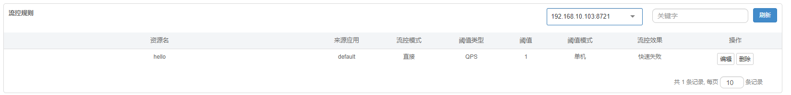
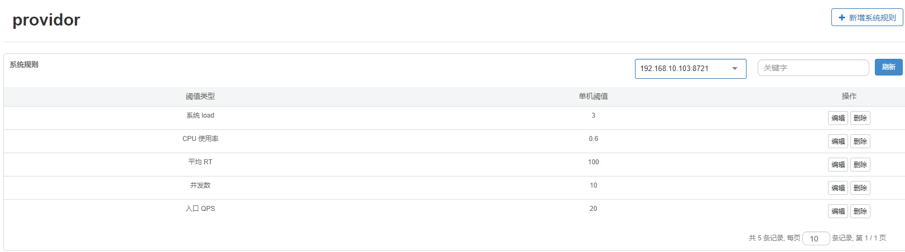

###sentinel

[https://github.com/alibaba/Sentinel/wiki/%E4%BB%8B%E7%BB%8D](https://github.com/alibaba/Sentinel/wiki/%E4%BB%8B%E7%BB%8D "文档")

[https://github.com/alibaba/Sentinel/wiki/%E5%A6%82%E4%BD%95%E4%BD%BF%E7%94%A8](https://github.com/alibaba/Sentinel/wiki/%E5%A6%82%E4%BD%95%E4%BD%BF%E7%94%A8 "使用")

[https://github.com/alibaba/spring-cloud-alibaba/wiki/Sentinel](https://github.com/alibaba/spring-cloud-alibaba/wiki/Sentinel "springcloud alibab")

[https://github.com/alibaba/Sentinel/wiki/%E7%BD%91%E5%85%B3%E9%99%90%E6%B5%81#spring-cloud-gateway](https://github.com/alibaba/Sentinel/wiki/%E7%BD%91%E5%85%B3%E9%99%90%E6%B5%81#spring-cloud-gateway "网关限流")

####使用
#####sentinel控制台
1.下载控制台jar包

2.执行
	
	java -Dserver.port=8080 -Dcsp.sentinel.dashboard.server=localhost:8080 -Dproject.name=sentinel-dashboard -jar sentinel-dashboard.jar

3.登录查看控制台：
	http://47.107.142.148:8080/#/dashboard

#####sentinel 整合spring cloud gateway.

1. gateway 网关接入：

	启动参数添加：
		
		#表明是一个网关	
		-Dcsp.sentinel.app.type=1		
		-Dcsp.sentinel.dashboard.server=localhost:8080

2. 普通的client 接入：
		
		#表示注册到localhost:8080 的sentinel控制台上。
		-Dcsp.sentinel.dashboard.server=localhost:8080

3. 通常，在目前的使用场景下，如果需要限流的话，我只需要把网关接入到sentinel中就行

#####配置
对于流量进行限流配置:

	

不断的刷新，可以看到1秒只能有1个正常的响应，其他请求都被限流。

服务注册到云端时,由于IP限制的原因，无法获取到限流信息。因此配置改为本地配置

系统自适应限流规则：
[https://github.com/alibaba/Sentinel/wiki/%E7%B3%BB%E7%BB%9F%E8%87%AA%E9%80%82%E5%BA%94%E9%99%90%E6%B5%81](https://github.com/alibaba/Sentinel/wiki/%E7%B3%BB%E7%BB%9F%E8%87%AA%E9%80%82%E5%BA%94%E9%99%90%E6%B5%81 "自适应限流")
	
代码：
	
	@Slf4j
	@Configuration
	public class SentinelConfig {
		
		@Bean
		public SentinelConfig.SysRule sysRule() {
			return new SentinelConfig.SysRule();
		}
		static class SysRule {
			/**
			 * 系统自适应的限流规则
			 */
			private   SysRule() {
				log.info("系统自适应限流规则添加");
		        List<SystemRule> rules = new ArrayList<SystemRule>();
		        SystemRule rule = new SystemRule();
		        // max load is 3
		        rule.setHighestSystemLoad(3.0);
		        // max cpu usage is 60%
		        rule.setHighestCpuUsage(0.6);
		        // max avg rt of all request is 10 ms
		        rule.setAvgRt(100);
		        // max total qps is 20
		        rule.setQps(20);
		        // max parallel working thread is 10
		        rule.setMaxThread(10);
	
		        rules.add(rule);
		        SystemRuleManager.loadRules(Collections.singletonList(rule));
		    }
		}
		
	}
限流效果截图：
	

这是默认的限流，还可以在sentinel控制台来控制CPU使用率，并发线程数，总的QPS修改配置值。

####熔断降级

1.使用@SentinelResource 注解

2.参考：

[https://mrbird.cc/Spring-Cloud-Alibaba-Sentinel-SentinelResource.html](https://mrbird.cc/Spring-Cloud-Alibaba-Sentinel-SentinelResource.html "异常回退")

3.参考demo

